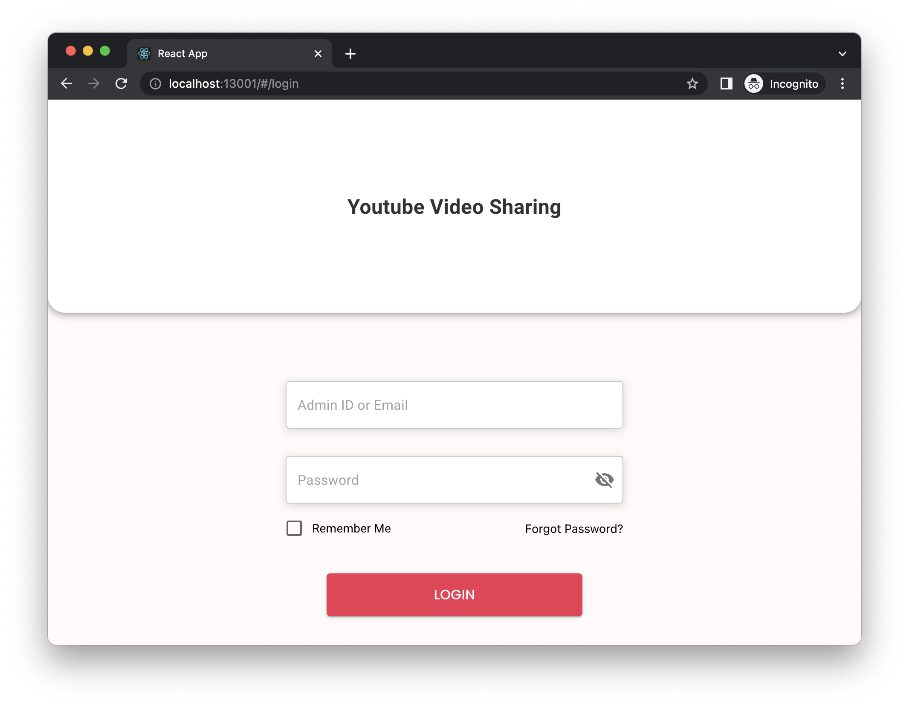

# App Introduction
The YoutubeSharing is a simple application that allows users to share their interesting Youtube videos across the platform. Once a user shares a new video, that video will be nofified to all online users of the platform.

# Prerequisites
You need:
- `NodeJS v18`, `npm`, `yarn`: installed on your machine. See [https://nodejs.org/en/download](https://nodejs.org/en/download) for more detail.
- Lastest `Docker` installed on your machine. See [https://docs.docker.com/engine/install](https://docs.docker.com/engine/install) for more detail.
- Latest `Git` installed on your machine. See [https://git-scm.com/downloads](https://git-scm.com/downloads) for more detail.
- Latest `typeorm` cli, we need this tool to run the data migration. See [https://typeorm.io/using-cli#installing-cli](https://typeorm.io/using-cli#installing-cli) for more detail. In fact you just need to run this command `npm install -g typeorm` on your machine.
- OS: `MacOS` or Linux (I tested on MacOS 13.4 only)

# Setup YoutubeShare project on local
## Checkout projects

**Step 1:** Create a root folder for YoutubeShare project. I called it `PROJ_HOME`

**Step 2:** Checkout the projects

```sh
cd $PROJ_HOME

git checkout https://github.com/paultran0920/youtube-share.git

git checkout https://github.com/paultran0920/youtube-share-be.git

git checkout https://github.com/paultran0920/youtube-share-fe.git
```

## Configure projects
You do not need to configure anything to bring up this application on your local as I already prepared the Docker configuration, you just need to start the Docker then you can use it.

For development environment, please follow the `Development` section.

## Start project on local
The following step is very slow, it depended on your machine. Normally it will take around 10 minutes to 30 minutes to download the docker images and npm package dependencies.

```sh
cd $PROJ_HOME/youtube-share

# Build the docker images
docker-compose build

# Start application from docker images
docker-compose up
```

## Database migration
Once the database server started, please run the following steps to start database migrations
```sh
cd $PROJ_HOME/youtube-share-be

# Install needed npm packages
yarn install --frozen-lockfile

# Migrate data
npm run typeorm migration:run -- -d ./scripts/datasource.ts
```

After this step, the following data will be created:

1. All tables of this application
2. Users
```
Admin:  super.admin@gmail.com 
User 1: user.1@gmail.com
User 2: user.2@gmail.com

With the same password: Abc@123456
``` 
3. Some shared youtube video information for DEMO

## Verify YoutubeShare application

Once the application started, you should see the following logs in the docker compose window.
```sh
youtube-share-fe  | webpack compiled successfully
youtube-share-fe  | No issues found.
youtube-share-fe  | Compiling...
youtube-share-fe  | Compiled successfully!
youtube-share-fe  | webpack compiled successfully
youtube-share-fe  | No issues found.
```

Then open your browser and navigate to [http://localhost:13001/#/login](http://localhost:13001/#/login), you should see a login screen like this



Login with one of the [above users](#database-migration) and explore the application. Have fun 🕺

# How to use this application
## See this video for application features
[](https://www.youtube.com/watch?v=RODQhnuAPb8)

## Live DEMO
I also deployed this application on a free server. It will be suspended if inactive so please wait for a while to bring it back if you open it

Open [Youtube Video Sharing](https://youtubeshare-web.onrender.com)

See [Database Migration](#database-migration) for user email and password

**TIP:** You should re-open the application after login to ensure that the ws work correctly.

# Development
To configure this project for development on your local, you need to do some additional steps.

## BackEnd
### Configuration

If you want to develop the BackEnd side

Create the `local` folder
```sh
cd $PROJ_HOME/youtube-share-be
mkdir local
```

Create a new `local/.env` for your local development with this content
```sh
PORT=13002
JWT_KEY="*adsd%^765HBN"
DB_URL="localhost"
DB_PORT=13306
USER_NAME="youtube_share_user"
PASSWORD="youtube_share_password"
DATABASE="youtube-share-db"
```

### Run Unit Test
See the scripts in `package.json` file

I prepared some [Unit Test here](https://github.com/paultran0920/youtube-share-be/blob/master/src/youtube/__tests__/youtube.controller.spec.ts), you can take a look for more detail if needed.

```sh
yarn test
```
### Run Unit Test and Code coverage
See the scripts in `package.json` file
```sh
yarn test:cov
```

### Run Integration/E2E Test
See the scripts in `package.json` file
For the e2e test, because it will start a `real` environment for testing so maybe it will take longer than UT and not stable if compared to UT.

I prepared some [E2E Test here](https://github.com/paultran0920/youtube-share-be/blob/master/test-e2e/youtube.e2e-spec.ts), you can take a look for more detail if needed.

```sh
yarn test:e2e
```

### Start App
This command will start the BackEnd on your local at port `13002`
```sh
yarn start
```

## FrontEnd
### Configuration

If you want to develop the FrontEnd side

```sh
cd $PROJ_HOME/youtube-share-fe
```

Create a new `.env.local` for your local FrontEnd development with the following content
```sh
REACT_APP_BE_ROOT="http://localhost:13002"
REACT_APP_NODE_ENV="development"
```

**Important Note:** it is `.env.local` file not `local/.env` file.

### Run Unit Test
I prepared some [Unit Test here](https://github.com/paultran0920/youtube-share-fe/blob/master/src/components/shared-videos/__tests__/shared-video-info.spec.tsx), you can take a look for more detail if needed.

```sh
yarn test
```

### Start App
This command will start your web application development server at port `3000`
```sh
yarn start
```

## Useful commands for development

Start only the database server:

```sh
cd $PROJ_HOME/youtube_share

docker-compose up mysql
```

Start only the mysql server and backend server
```sh
cd $PROJ_HOME/youtube_share

docker-compose up mysql backend
```

Start only the mysql server and frontend app
```sh
cd $PROJ_HOME/youtube_share

docker-compose up mysql frontend
```
